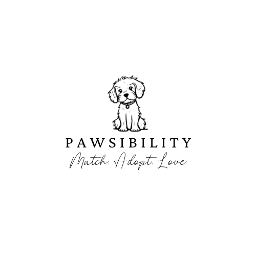

<p align="center">
  
</p>

# A Personalized Dog Adoption Application


## About Pawsibility

Welcome to Pawsibility, where the journey to find your perfect furry companion begins. We understand that every individual and family has unique needs and circumstances. Whether it's the size of your home, existing pets, or the presence of young children, we believe that each factor plays a crucial role in ensuring a harmonious match between you and your future pet.

At Pawsibility, we are passionate about connecting loving families with deserving dogs in need of forever homes. We've revolutionized the adoption process by personalizing it. Our platform intuitively gathers insights about your lifestyle, home environment, and preferences to curate a selection of dogs that align with your specific situation. By taking the guesswork out of the equation, we make the adoption journey not just easier, but also more rewarding.

## How to Use Pawsibility

To get started with Pawsibility:

### From your source-code editor:
1. Clone the repo onto your local computer.
2. ``` npm install ``` dependencies.
3. Run ``` npm run start ``` and you're good to go!
